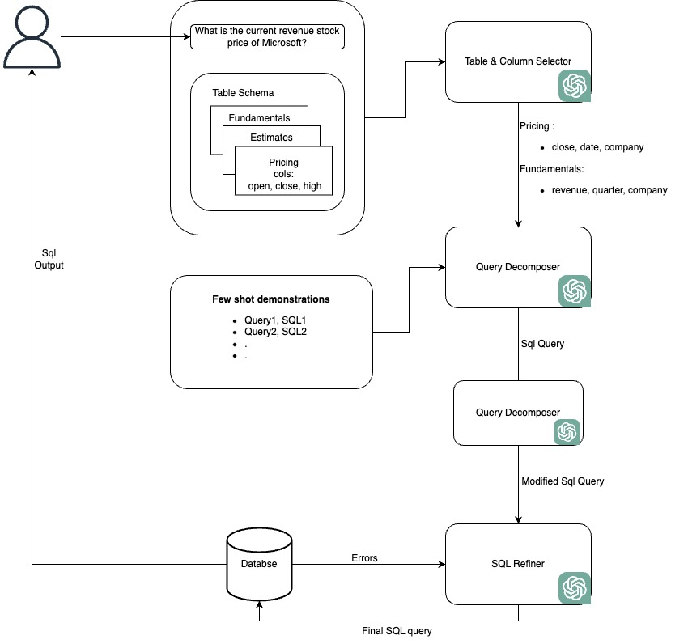

## Introduction

The goal of the project is to enhance the performance of text-to-SQL conversion using an agentic approach. Each agent in the system will handle a specialized task in the SQL generation process. The project aims to evaluate the performance of the existing [MAC-SQL](https://arxiv.org/pdf/2312.11242) approach, implemented on an open-source model (Llama2), and to achieve better results. This will be accomplished through prompt engineering, the addition of specialized agents, or fine-tuning the model to create more effective agents tailored for specific tasks in the text-to-SQL pipeline.

## Overall Flow




## Environment

1. Config your local environment.

```bash
conda create -n macsql python=3.9 -y
conda activate macsql
pip install -r requirements.txt
python -c "import nltk; nltk.download('punkt')"
```

2. Install ollama, download llama3.1 8B model and start the server.

```bash
curl -fsSL https://ollama.com/install.sh | sh
ollama pull llama3.1
./ollama serve 
```

This will help us to give the model an input thriugh rest API.

## Data Sets

Download the bird and spider datasets from [Google Drive](https://drive.google.com/file/d/1kkkNJSmJkZKeZyDFUDG7c4mnkxsrr-om/view?usp=sharing).
After downloading the `data.zip` file, you should delete the existing data folder in the project directory and replace it with the unzipped data folder from `data.zip`.


## Run

The run script (run.sh) contains the commands to run the pipeline on spider and bird datasets. All the logs and predictions are stored in output folder.

## Evaluation

After running the run.sh script, run the evaluation scripts `evaluation_spider_ex.sh` for spider and `evaluation_bird_ex_ves.sh` for bird dataset.

## Demo

Run `streamlit run demo.py`


## Results

### Spider (EX)

Here’s the table updated with the additional column for **Execution Accuracy (%) (With Review Agent Modified Prompt)**:

---

## Results

### Spider (EX)

| Difficulty Level | Count | Execution Accuracy (%) (Without Review Agent) | Execution Accuracy (%) (With Review Agent) | Execution Accuracy (%) (With Review Agent Modified Prompt) |
|------------------|-------|-----------------------------------------------|--------------------------------------------|-----------------------------------------------------------|
| Easy             | 248   | 61.1                                          | 61.3                                       | 65.3                                                      |
| Medium           | 446   | 51.6                                          | 54.3                                       | 53.6                                                      |
| Hard             | 174   | 37.4                                          | 37.4                                       | 39.1                                                      |
| Extra            | 166   | 22.3                                          | 26.5                                       | 23.5                                                      |
| **All**          | 1034  | 47.0                                          | 48.6                                       | 49.1                                                      |

---


### Bird (EX)

| Difficulty Level | Count | Execution Accuracy (%) |
|------------------|-------|------------------------|
| Simple           | 925   | 22.92                  |
| Moderate         | 465   | 11.61                  |
| Challenging      | 144   | 5.56                   |
| **Total**        | 1534  | 17.86                  |


